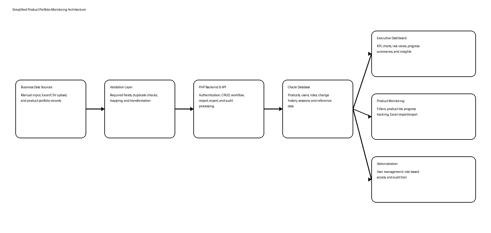
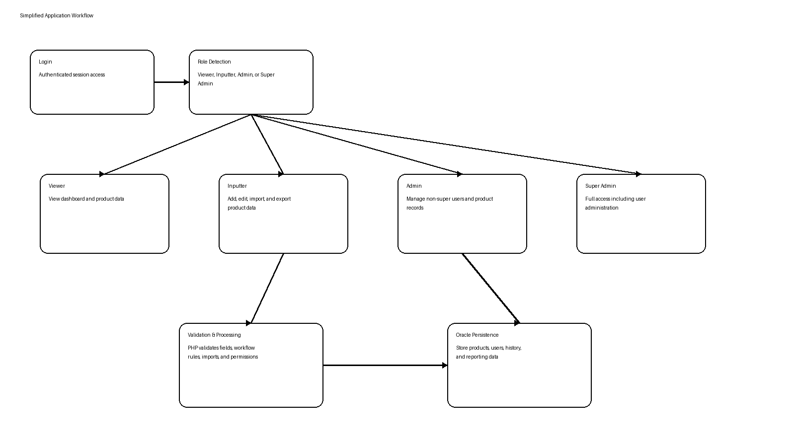
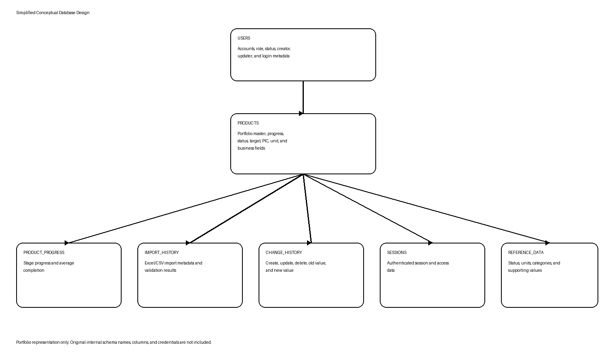
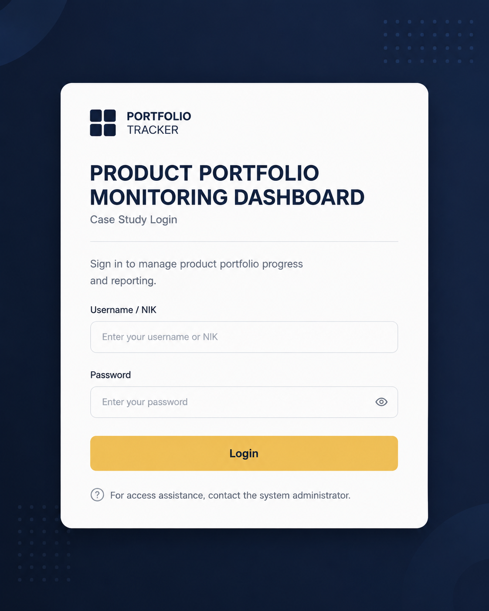
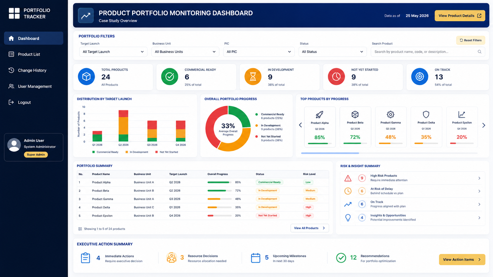
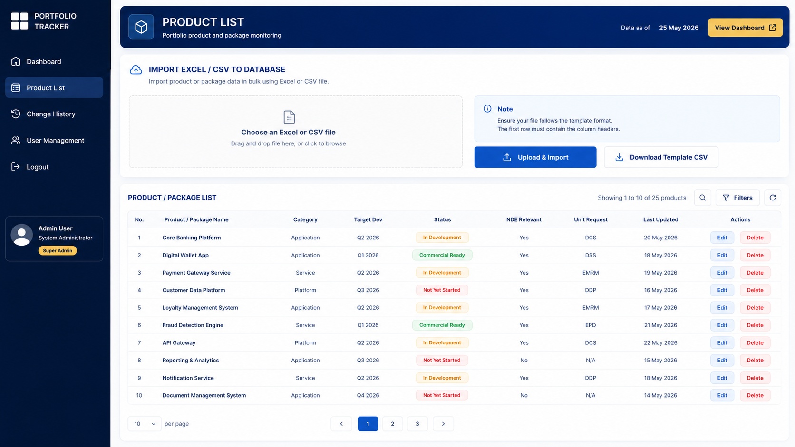
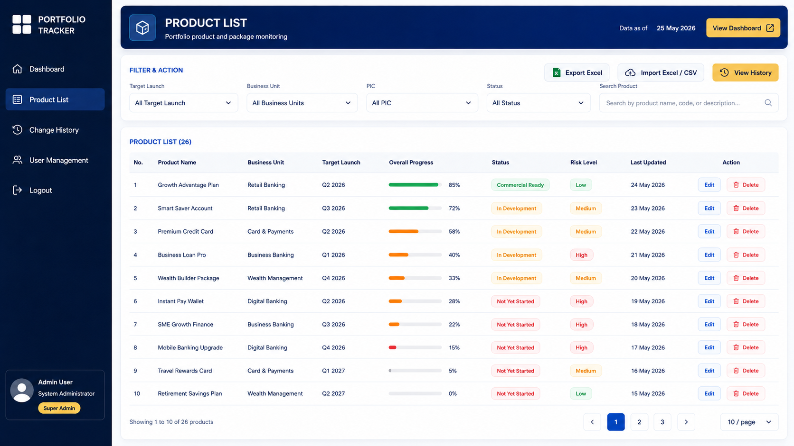
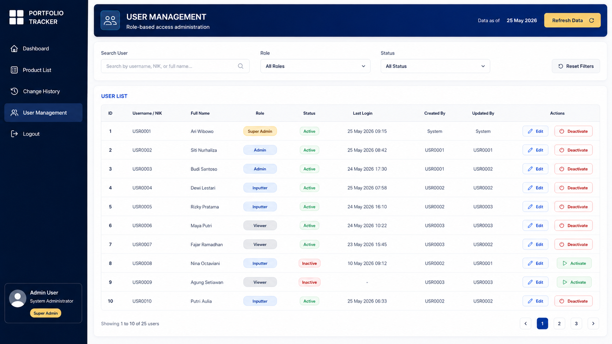
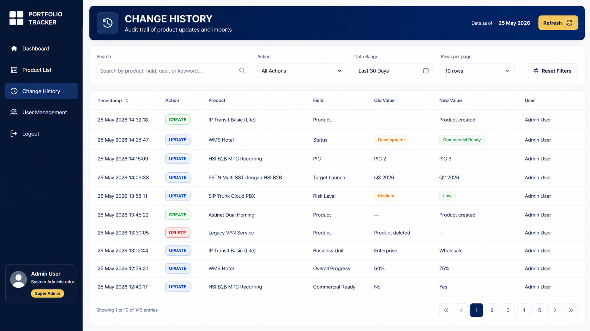

<div align="center">

# Product Portfolio Monitoring Dashboard

### An Anonymized Data Engineering & Business Intelligence Case Study

**Oracle Database · PHP · SQL · Excel/CSV Import · Dashboard · Workflow · Role-Based Access**

</div>

---

## Overview
This case study focuses on the end-to-end data lifecycle: collection, validation, transformation, Oracle persistence, API processing, dashboard visualization, and auditability.

This repository presents an anonymized portfolio case study of an enterprise product portfolio monitoring dashboard developed to centralize product tracking, progress monitoring, Excel/CSV data import, change history, user administration, and executive reporting.

The original application was developed for an internal enterprise environment. Original source code, credentials, internal infrastructure details, company branding, employee information, and actual business records are not included.

> **Visual note:** The screenshots below are anonymized portfolio recreations based on the implemented system. They use synthetic names, values, and branding to protect confidential company information.

---

## Project Snapshot

| Item | Description |
|---|---|
| Project Type | Enterprise Product Portfolio Monitoring Dashboard |
| My Role | Data & Business Intelligence Engineer |
| Database | Oracle Database |
| Backend | PHP and REST-style API |
| Frontend | HTML, CSS, and JavaScript |
| Data Input | Manual forms and Excel/CSV import |
| Core Functions | Dashboard, product monitoring, workflow, reporting, import/export, and RBAC |
| Environment | Enterprise intranet |
| Data | Anonymized and synthetic portfolio data |

---

## Business Problem

Product and package monitoring was previously dependent on spreadsheet-based processes and distributed operational updates. This created difficulties in maintaining consistent progress data, identifying risks, tracking accountability, and producing timely executive reports.

The application was developed to centralize product portfolio information, automate structured import and validation, improve visibility into progress and risks, and provide traceable administrative controls.

---

## My Responsibilities

- Analyzed product monitoring and reporting requirements
- Designed and managed Oracle database structures
- Developed PHP-based backend processes and REST-style API endpoints
- Implemented data validation, transformation, and duplicate handling
- Built Excel/CSV import and export workflows
- Developed interactive dashboard summaries and visualizations
- Implemented product monitoring, filtering, search, and pagination
- Created role-based access for Viewer, Inputter, Admin, and Super Admin
- Added user management and change-history audit trails
- Supported testing, troubleshooting, deployment, and documentation
- Converted operational product data into actionable executive insights

---

## System Architecture



---

## Application Workflow



---

## Main Features

- Authentication and session management
- Product portfolio dashboard
- Product and package progress monitoring
- Executive KPI and status summaries
- Target launch and business-unit filtering
- PIC and status filtering
- Product search and pagination
- Manual product input and editing
- Excel/CSV bulk import
- Template download and Excel export
- Duplicate and validation handling
- Change history and audit trail
- User management and role-based access control
- Oracle database integration
- Responsive web interface

---

## User Roles

| Role | Main Access |
|---|---|
| Viewer | View dashboard and product data |
| Inputter | Add, edit, import, and export product data |
| Admin | Manage non-super users and product records |
| Super Admin | Full application and user administration |

---

## Simplified Database Design



---

## Technology Stack

| Layer | Technology |
|---|---|
| Database | Oracle Database |
| Query Language | SQL |
| Database Connection | OCI8 |
| Backend | PHP |
| API | REST-style API |
| Frontend | HTML, CSS, JavaScript |
| Visualization | JavaScript-based charts |
| Data Import | Excel and CSV |
| Server | Apache HTTP Server |
| Operating System | Linux |
| Database Tool | DBeaver |
| Development Tool | Visual Studio Code |
| Version Control | Git and GitHub |

---

## Screenshots

### Login Screen



### Dashboard Overview



### Product List and Import Workflow



### Product Monitoring List



### User Management and Role-Based Access



### Change History and Audit Trail



---

## Key Challenges

- Transforming spreadsheet-based monitoring into a structured application workflow
- Maintaining consistent product, progress, PIC, status, and target-launch data
- Designing Excel/CSV import logic with validation and duplicate handling
- Integrating PHP applications with Oracle Database through OCI8
- Implementing access separation across multiple user roles
- Preserving traceable change history
- Presenting complex portfolio data in a dashboard that remains understandable
- Protecting confidential enterprise information in public documentation

---

## Design Decisions

- Oracle Database was used as the central system of record.
- PHP handled backend validation, import processing, workflow logic, and API responses.
- Manual input and Excel/CSV import were both supported to accommodate operational needs.
- Role-based access separated viewing, input, administration, and super-administration functions.
- Change history was stored separately to preserve traceability.
- Public portfolio visuals use synthetic data and neutral branding.

---

## Project Outcomes

- Centralized product portfolio monitoring
- Improved visibility of product progress and target launch
- Reduced dependency on manual spreadsheet reporting
- Improved data consistency through structured validation
- Added traceability through change history
- Established clearer role-based access
- Enabled faster executive reporting and operational follow-up

---

## Skills Demonstrated

- Data Engineering
- Business Intelligence
- Oracle Database and SQL Development
- PHP Backend and API Development
- Excel/CSV Data Integration
- Data Validation and Transformation
- Dashboard Development and Data Visualization
- Workflow Design
- Role-Based Access Control
- Audit Trail and Change History
- Application Testing and Deployment
- Technical Documentation

---

## Repository Structure

```text
product-portfolio-monitoring-dashboard-case-study/
├── README.md
└── docs/
    ├── architecture-diagram.png
    ├── workflow-diagram.png
    ├── database-design.png
    └── screenshots/
        ├── login-screen.png
        ├── dashboard-overview.png
        ├── product-list-import.png
        ├── product-list.png
        ├── user-management.png
        └── change-history.png
```

---

## Confidentiality Notice

This repository is intended for portfolio and educational purposes. It does not contain original source code, real company or product data, employee identifiers, credentials, internal URLs, confidential documents, original database schemas, or actual financial values.

All visual examples, names, values, diagrams, workflows, and structures have been simplified, anonymized, or recreated using synthetic examples.

---

<div align="center">

**Turning product portfolio data into reliable workflows, dashboards, and actionable business insights.**

</div>
